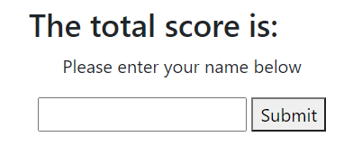

#  Re-view

As students or aspiring learners, it is good to often brush up on the items that a person added to their knowledge.  If this is not done, it is possible to forget what one has learned.  It is good to review what was covered to ensure that the knowledge has become solidified in one's own mind. 

## Table of Contents 

*[Purpose](#purpose)
*[Instillation](#instillation)
*[Features](#features)
*[Credits](#credits)

## Purpose 

The purpose of this application is to give a quiz about the basics of learning coding.  These questions are presented in multiple choice and, as a whole, is timed.  This will help the learner review and see how well they did.  

## Instillation 
**To edit/use the application, please follow the steps to pull the repository from GitHub through Git Bash and pull the script into VSCode, provided all three items are already installed on a local network.**

Instillation steps are as follows:
1. Access the repository at [Git Hub] https://github.com/Napica/HW-04-Study-Code-Quiz. 
2. Click on the code section (in green) and clone the SSH key.  
3. Once the SSH key is cloned, open the terminal through Git Bash.
4. Find or create the folder the user wants to work in and enter the following commands the the Git terminal:
    1. git clone [copied link]    (*this will allow access the repository to the local computer.*)
    2. git pull (*this will pull all the lines of script from the local repository.*)
    3. code . (*This will extract the code and link the paths to VSCode for review/editing/uploading)

#### [For Direct Access to GitHub provided application site]

Please click on the link below: 
1. https://napica.github.io/HW-04-Study-Code-Quiz/

## Features

This application comes with a timer.  If the timer reaches 0, the user will be sent to a forms page to submit their name.  

This application comes with a submit section to show the scores of the individual who took the quiz. 

## Credit

I would like to thank the help of my TA's/Tutors/Classmates for the assisstance in making this application possible. 